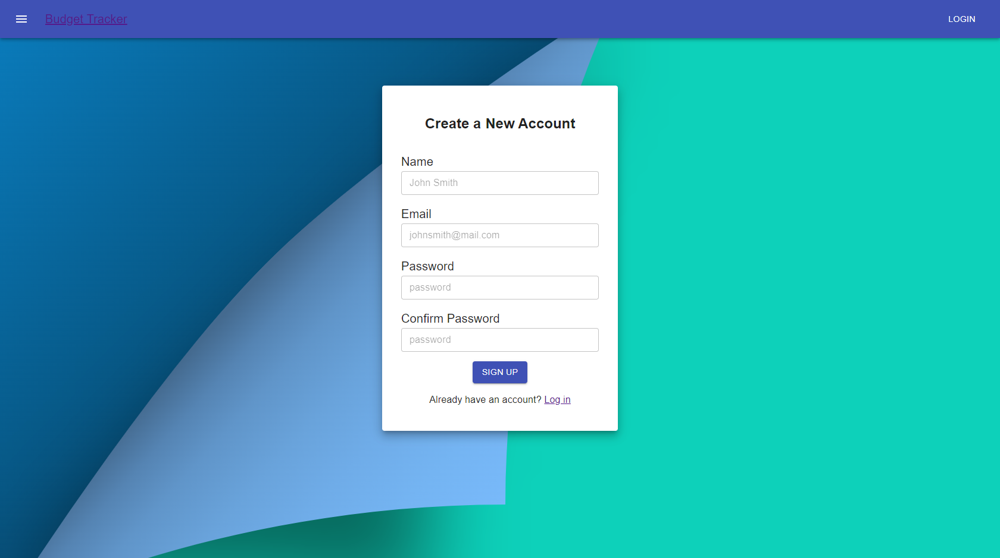
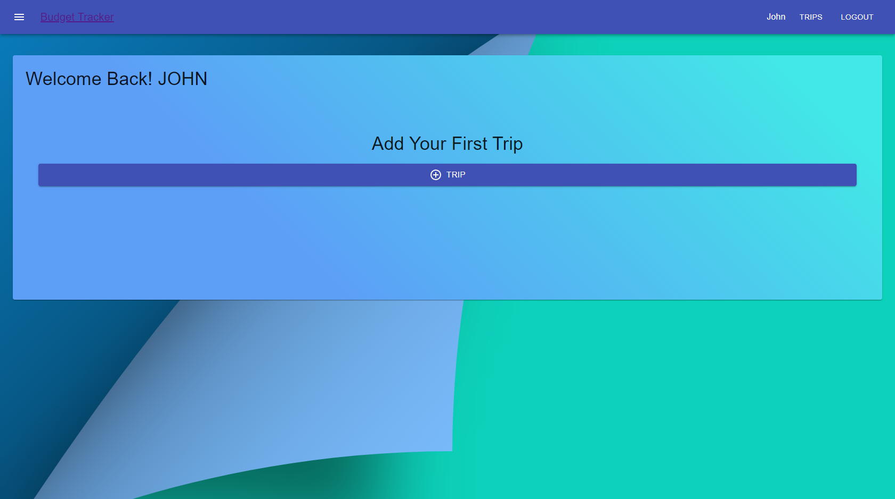
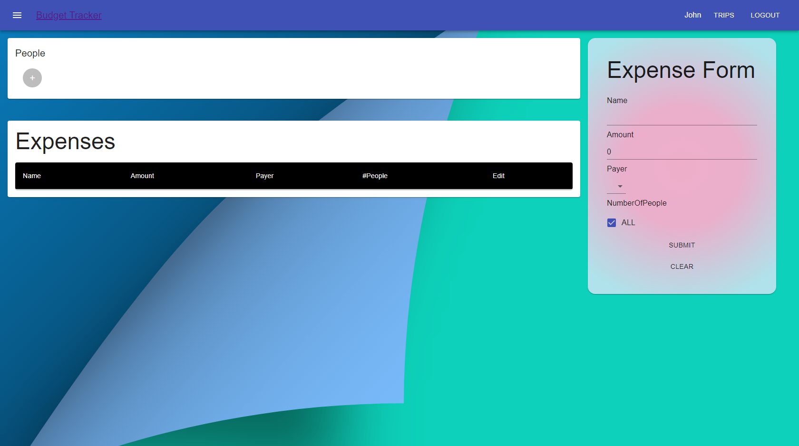
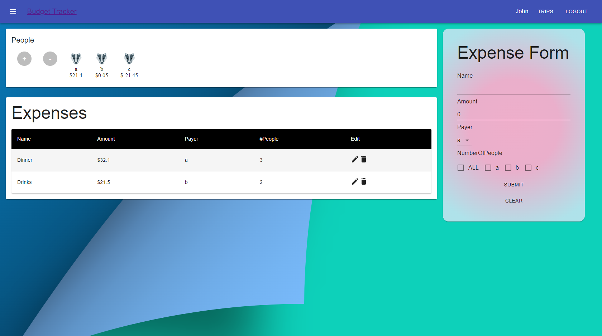

# Budget Tracker

[Budget Tracker](http://52.37.85.94:3000) is an online website that helps user to keep track of expenses for a trip. It helps user to calculate the expenses for each person in the trip.

## Preview

## Guide

1. User needs to sign up a account prior access to the webite.
2. User can add trip in the user page.
3. User need to add people in the expense page prior adding any expenses.
4. User can add expense in the Form section by providing description, amount, payer, and who is responsible for that certain expenses.
